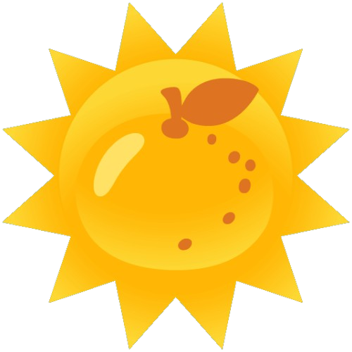

#  Eletricitrus - Portal de Energia Solar Assinada

> **Projeto Sartup - Facens (Análise e Desenvolvimento de Sistemas)**

O **Eletricitrus** é uma plataforma web voltada para o setor de energia solar fotovoltaica e sustentável. O objetivo do projeto é conectar consumidores a fazendas solares parceiras, oferecendo ferramentas interativas para cálculo de economia e conscientização ambiental através de uma identidade visual amigável e acessível.

---

## 🚀 Funcionalidades Principais

- 📊 **Calculadora de Economia:** Estimativa personalizada de economia mensal e anual com energia solar.
- ☀️ **Mascote Interativo ("Sem nome definido"):** Experiência guiada e amigável para engajamento do usuário.
- 🏞️ **Catálogo de Fazendas Solares:** Exibição detalhada e comparativo de parceiras (...).
- 🏷️ **Guia de Placas Solares:** Informações técnicas e educativas sobre tecnologia fotovoltaica.

---

## 🎨 Identidade Visual e UI/UX

### Paleta de Cores

| Cor | Nome / Uso | Código HEX |
| :--- | :--- | :--- |
| **Carvão** | Fundo Navbar / Escuro | `#1B1712` |
| **Bege** | Fundo Principal | `#F6EFE2` |
| **Bege Claro** | Cards / Content | `#FBF7EE` |
| **Texto Escuro** | Texto Principal | `#241F18` |
| **Dourado** | Destaques / Detalhes | `#D9A441` |
| **Laranja** | Botões & Ações Primárias | `#C1560C` |
| **Laranja Escuro** | Estados de Hover | `#96420A` |

### Navegação e Componentes
- **Navegação Padronizada:** Menu responsivo com dropdowns em cascata integrados via `menu.css`.
- **Mascote Interativo ("Solzinho"):** Apoio visual dinâmico para engajamento e identidade da marca.

---

## 🛠️ Tecnologias Utilizadas

- **HTML5:** Estrutura semântica das páginas.
- **CSS3:** Estilização modular (flexbox, grid, variáveis CSS e animações).
- **JavaScript (ES6+):** Lógica interativa da calculadora e comportamento dos elementos dinâmicos.
- **Git & GitHub:** Controle de versão e versionamento estruturado via *Conventional Commits*.

---

## 📂 Estrutura de Pastas

```text
Startup/
├── css/
│   ├── erro404.css
│   ├── fazendas.css
│   ├── index.css
│   ├── informacoes.css
│   ├── mascotinho.css
│   ├── menu.css
│   └── placas.css
├── html/
│   ├── 404.html
│   ├── calculadora.html
│   ├── fazendas.html
│   ├── index.html
│   ├── informacoes.html
│   └── placas.html
├── imagens/
│   └── ... (imagens do mascote e logos)
└── js/
    └── calculadora.js
```

---

## 🔧 Como Executar o Projeto

- **Clona este repositório:**

- git clone https://github.com/arthurlncost/Startup.git

- **Navega até a pasta do projeto:**

- cd Startup

- **Abre no navegador:**

- Navega até a pasta html/ e abre o ficheiro index.html em qualquer navegador web (Chrome, Edge, Firefox, etc.).

---

## 👥 Autores

Desenvolvido por estudantes do curso de **Análise e Desenvolvimento de Sistemas (ADS) - Facens**:

- **Ana Clara R. de Oliveira**
- **Arthur Luciano N. da Costa**
- **Giovanni Paulossi C. Dantas**
- **Leonardo de Sousa L.**
- **Tiago José R. Burani**
- **Vitoria Carara C.**
